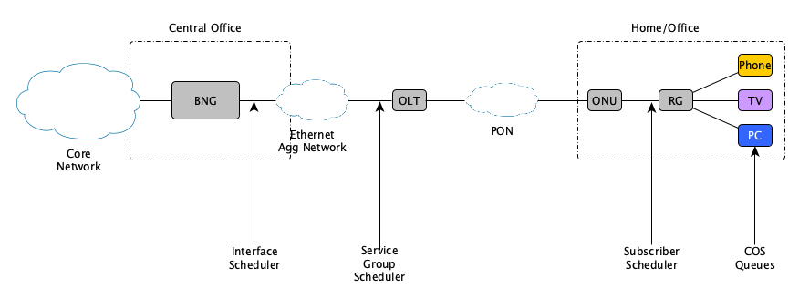
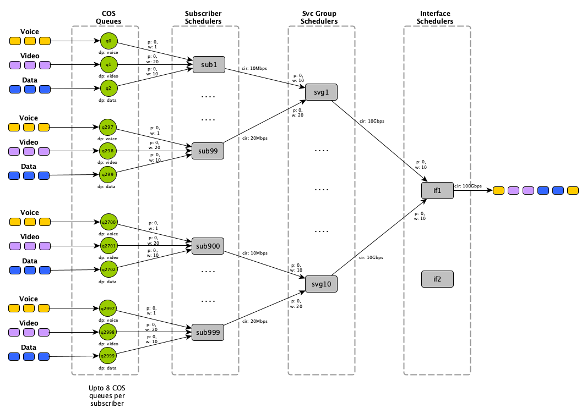
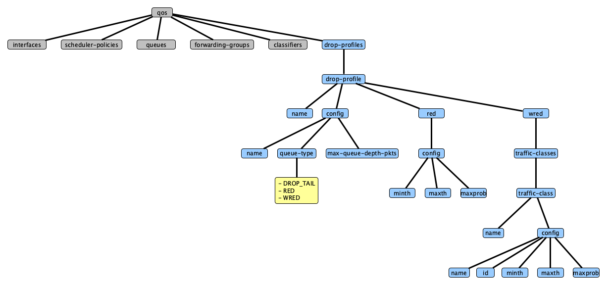
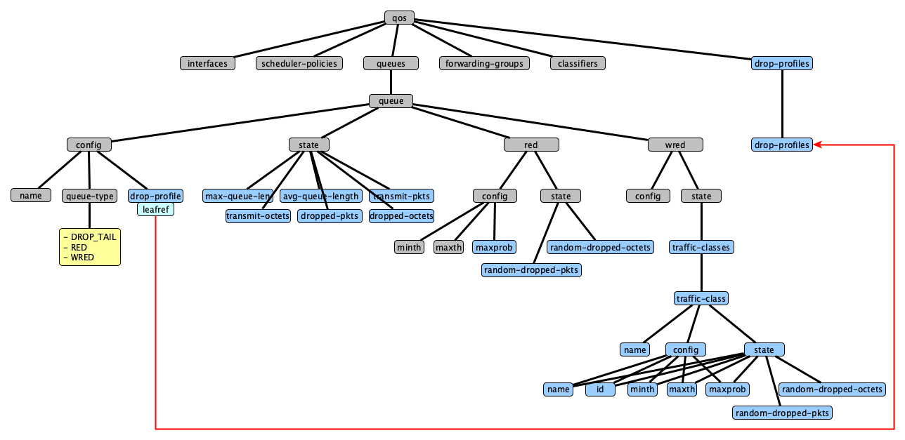
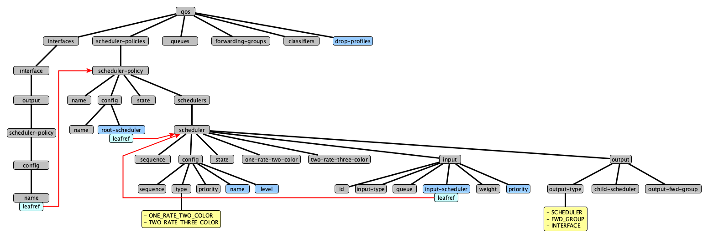

<!--
Copyright 2020-present Open Networking Foundation
Copyright 2020-present Dell EMC

SPDX-License-Identifier: Apache-2.0
-->

# Configuration and Management of HQoS

This file includes the architecture and OpenConfig QoS yang model extensions
to be able to configure and monitor Hierarchical QoS using Stratum.

Table of contents
- [What is HQoS](#what-is-hqos)
- [OpenConfig QoS yang model extensions](#openconfig-qos-yang-model-extensions)
- [Example HQoS data model](#example-hqos-data-model)


## What is HQoS

Hierarchical Quality of Service (HQoS) is used by "Network Functions" like BNG (Broadband Network Gateway for fixed line subscriber termination) and UPF (User Plane Traffic for 5G subscriber termination) to ensure that all of the subscribers traffic is given a fair share of the bandwidth based on polcies that are applied at the "Network Function".

HQoS works by allowing schedulers to be placed in hierarchical in order to mimic the transport access network as shown in the following diagram of a typcial BNG Network Function.



As you can see in the above diagram the BNG network function has it's subcribers connected to it via the ethernet aggregation network and then the optical network on the left (note: this same architecture holds for other access technologies like HFC, DSL, Fixed Wireless, etc).  Each of these networks will have certain choke points where the downstream bandwidth could exceed a links capacity and cause packets to be randomly dropped.

To ensure this does not happen we use HQoS in the network function to create a hierarchy of schedulers as per the following diagram that mimics the downstream transport network.  You'll note the three levels of schedulers in the "High Level BNG network architecture" diagram corresponds to the three level of schedulers in this HQoS model.



This HQoS data model will need to be configured into the Stratum hardware (i.e. Switch or SmartNIC) by the Network Function and we're proposing that this is done using the standardised gNMI interface with some extensions to the existing OpenConfig QoS yang models.  These changes will be fully explained in the following section.

## OpenConfig QoS yang model extensions

The current OpenConfig QoS yang models are incomplete when it comes to configuring a proper Hierarchical QoS data model like the example given in the previous section.  This document details the suggested changes needed to enable the QoS yang model to be used for HQoS.

The top level OpenConfig QoS yang model tree is shown in the following diagram, suggested additions or changes to the existiing OpenConfig yang models will be shown in blue throughout this document, similar to the "drop-profiles" node in this diagram.


Each of the sub-trees will now be covered in detail in the following sections.

### QoS Drop Profiles (/qos/drop-profiles)

A new sub-tree has been added to the QoS node to allow "drop profiles" to be configured separately to the actual queue.  This node has been introduce for two reasons:
1. it allows the drop profiles to be configured once and then referenced from the queues making for a less verbose configuration
2. some hardware data planes have limitations on the number of drop profiles that can be configured (i.e. the maximum number of drop profiles is less than the maximum number of queues configurable in the hardware)



The drop profiles are indexed by name and have the same attributes that are available per queue (Note: it may make sense to remove the drop profile information from the QoS Queue nodes at some point, although this would likely needed to be deprecated over time).

Things to note:
1.  the Weighted RED (WRED) drop profiles are indexed by a traffic-class name 
2.  each WRED traffic-class has a target specific 'id' (i.e. "EF", "CS0", "AF43", "IPP0", etc)
3.  A maximum probability RED percentage has been added to the RED and WRED configurations.
4.  There is no state information held for drop profiles as these are only configuration data, the operational state data is held in the actual QoS queue.

### QoS Queues (/qos/queues)

A few changes have been made to the QoS Queues nodes as per the blue nodes in the diagram below.



#### .../queue/config

The drop profile configuration data for the queue has replicated in the drop-profile node and the user has the choice of configuring this drop profile data either directly in the queue's config nodes or in the drop-profile node based on the use case and requirement. Although it is suggested to use the drop-profile node because of the reasons mentioned in the drop profile section and the desire to deprecate this configuration data over time.

The "drop-profile" in the `/qos/queueus/queue/config` node points to a "drop-profile" in the `/qos/drop-profiles/drop-profile` list.  This then disconnects the 1:1 configuration of drop profiles and queues.

#### .../queue/state

The `/qos/queues/queue/state` has been augmented with the qos-interface-queue-state grouping in order to add the following state variables:
- max-queue-len: the maximum queue length in operation 
- avg-queue-len: the avergage queue length
- transmit-pkts: number of packets transmitted
- transmit-octets: number of octets transmitted
- dropped-pkts: number of packets dropped, includes random drop stats
- dropped-octets: number of octets dropped, includes random drop stats

#### .../queue/red/config

The RED configuration node has had the maximum probability integer added to it.

**Note:** This configuration data should only used if the drop-profile is not used.

#### .../queue/red/state

The RED operational state have had random dropped packets and octets counters added.

#### .../queue/wred/config

The WRED configuration has had the RED configuration data augmented to it (i.e. id, minth, maxth and maxprob) indexed by traffic class.  The traffic classes are indexed by a name string the same as the drop-profiles.  

**Note:** This configuration data should only used if the drop-profile is not used.

#### .../queue/wred/state

The WRED operational state has had random dropped packets and octets counters added.  The WRED state is indexed by a traffic-class list that will equate to the Traffic Classes configured in the drop profile for this queue.

### QoS Scheduler Policies /qos/scheduler-policies

All the schedulers pertaining to a particular interface will be created under one scheduler-policy.  This policy will then be added to an interface by setting the `/qos/interfaces/interface/output/scheduler-policy/config/name`.

The new `root-scheduler` leaf node as described below is then used by the interface to know which scheduler is the 'root' scheduler (i.e. interface scheduler) for the policy.



#### .../scheduler-policy/config

The `root-scheduler` leaf node has been added to the scheduler-policy configuration data so that when referenced by the interface it may easily tell which scheduler is the `root` scheduler to be used by this interface (this can be determined by searching through all the schedulers in a policy to look for an output type of 'INTERFACE', however this would be very innefficient with a large number of schedulers as is normally the case with a HQoS data model).

#### .../scheduler-policy/schedulers/scheduler

The schedulers in a scheduler policy are indexed by a unsigned 32 bit sequeunce number.  While this might suite some implementations well it doesn't make for a very readable configuration.  It might make more sense to index the schedulers with a name string as per the name that has been added to the configuration data (see below).

#### .../scheduler-policy/schedulers/scheduler/config

A 'name' string has been added to the scheduler config to make the configuration more readable.  As suggested above, it would make more sense to have this as the key and the sequeunce number as an optional leaf node in the configuration data.

A 'level' unsigned 8 bit number has been added to indicate the level in the HQoS hierarchy.  This is optional and maybe helpful for some HQoS implementations. (i.e. instead of having to calculate the level based on the distance from the root scheduler).

#### .../scheduler-policy/schedulers/scheduler/inputs/input/config

The input container specifies what is the input type (i.e. Queue, In-Profile Scheduler or Out-Profile scheduler) and then should also have a pointer to the queue or scheduler.

The current QoS model has a leafref node for a pointer to an input queue, but it doesn't have a pointer to an input scheduler.  While it could be possible to overload the 'id' string with a scheduler name, this won't allow the target to the yang schema to check for the existence of that scheduler.

The `input-scheduler` leaf node has been added to the configuration data to reference the scheduler in the current scheduler-policy (**Note:** we could also allow it to reference schedulers in different scheduler-policies by adding another leaf reference node to a scheduler-policy, but I don't think this is necessary at this stage).

A `priority` has also been added to the configuration data so that both weight and priority can be assigned to this input queue or scheduler.

## Example HQoS data model

A python script has been included as an example of how the OpenConfig QoS yang data model could be populated for a Hierarchical QoS use case given the suggested extensions above.  The following steps detail setting up the environment which will then allow the installer to run the python example code (i.e. oc_hqos.py).

Setting up the environment

1. Install python and pip

You'll need refer to your OS guide to install 'python' and 'pip' before continuing on with this install.

An example for Ubunto would be as follows:

```
sudo apt-get update
sudo apt-get install python
sudo apt-get install python-pip
```


2. Install pyang

```
sudo pip install pyang
```

3. Install the BBF, IETF and OpenConfig yang models

```
git clone this stratum repo
cd stratum/stratum/docs/gnmi/hqos
git clone https://github.com/BroadbandForum/yang.git BroadbandForum/yang
git clone https://github.com/YangModels/yang.git ietf/yang
git clone https://github.com/openconfig/public.git OpenConfig/yang
```

4. Build the pyang binding files

```
make
```

5. Run the Openconfig example code

This will output a json representation of the QoS data model based on the OpenConfig QoS yang model with the HQOS extensions.

```
python oc_hqos.py >oc_hqos.json
```

**Note:** You can also run the BroadbandForum HQoS example by running `python bbf_hqos.py >bbf_hqos.json`

